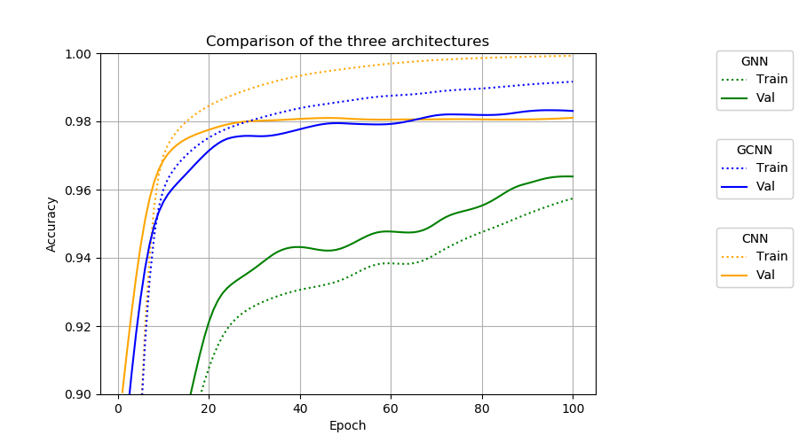
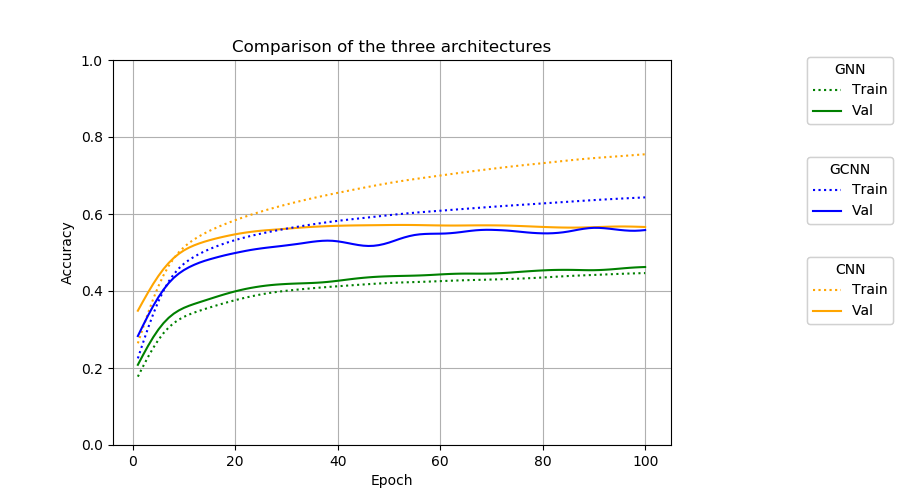

# RemoveTextBias

This repo contains python scripts to train and evaluate several model to classify images. The aim is to find model that are biased
towards shape and not texture (as are CNNs).

## The proposals

I propose an architecture called Geometrical neural network (GNN). This is a ResNet except that the following things are replaced :

- the convolution in CNN by a learned affine transformation.
- the max-pooling operation by an operation that find the maximumly activated region in a feature map and crop it to keep only this region (Region max-pooling (RMP)).
- the ReLU activation by an operation that set to zero every pixels that are not located in a specific area of the image.

Otherwise these are unchanged :
- Layers : Channels read the output of preceding channels
- Channel : each channel apply a transformation to each preceding channel and aggregates their results to one feature map with a (learned) ponderated sum.
- An average pooling is applied to the final feature map, as is done in a ResNet.

Let's compare it to the following architectures :

- CNN : a normal ResNet
- GCNN : a normal ResNet except each convolution is followed by an affine transformation.

## Results

Here are the results of training those three architectures on MNIST and CIFAR10. In both case we can see that *the GNN performs notably worse* than the two other. However, *it does not overfit at all* (the validation accuracy is superior to training accuracy), as opposed to the models that contains convolution, which are both clearly overfitting.

<figure>
  
 <figcaption>Accuracy evolution during training on MNIST.</figcaption>
</figure>

<figure>
  
 <figcaption>Accuracy evolution during training on CIFAR10.</figcaption>
</figure>


## Instalation

First clone this git. Then install conda and the dependencies with the following command :

```
conda env create -f environment.yml
```

## How does this code work ?

This code is organised with seral scripts and one config file :

- trainVal.py : trains a model and validate it. It records metrics value during training that you can later visualise with tensorboardX.

- dataLoader.py : builds the dataloader
- netBuilder.py : builds the models
- args.py : defines all the arguments
- model.config : defines the default value of the arguments :

- vis.py : contains functions to visualise the feature map or to optimise the image of a dataset to maximise some activation.
- processResults.py : will be used to further process the results but is currently empy.

## Data bases :

The datasets will download themselves when you will want to use them, excepts for ImageNet. To use ImageNet first instlal with the standard procedure
(detailed on the pytorch website). The dataset you can use are MNIST, CIFAR10 and ImageNet (but you have to download it and set it up manually). You can also
use a dataset of random noise image FAKENIST, which is useful in the vis.py script.

To select a dataset, use the --dataset argument with one of the following values : 'MNIST', 'CIFAR10', 'FAKENIST' and 'IMAGENET'.

## How to train a model ?

To train a CNN on MNIST during 100 epochs run the following command :

```
python trainVal.py -c model.config --dataset MNIST --model cnn --epochs 100
```

You will most likely train several models and to prevent this from becoming a mess you can indicate the name of the experience
with the --exp_id argument and the name of the model with the --model_id argument, like this :

```
python trainVal.py -c model.config --dataset MNIST --model cnn --epochs 100 --model_id model_test --exp_id first_experiment
```

During the experiment, you can see that two folders 'models' and 'results' have been created at the root of the project beside the folder 'code'.
In both of those folders, you can also find a folder called 'first_experiment' which contain respectively the model weights and the metrics evolution during training.

## How to visualise the results ?

You have to use tensorboardX to visualise the results. If the experiment name is 'first_experiment', run :

```
tensorboard --logdir=../results/first_experiment
```

Then, open your navigator at the adress indicated by tensorboard and admire the curves ! For each plot, you should see two curves for each training/trained model : one curve for the metrics value computed on the training dataset and one computed on the validation dataset.

## What model can I train ?

There are currently 6 models available. To choose one of them for training, you have to set the --model argument :

- 'cnn' : a small (9 layers) resnet model.
- 'gnn' : a model made by stacking affine transformation followed by box pooling. You can choose the number of channels of layers with --chan_gnn, the number of layers with --nb_lay_gnn. To add residual connection between layers use --res_con_gnn True, to use batch norm at every layers use --batch_norm_gnn True. To add a geometrical max pooling layer use --max_pool_pos 2 if you want to put the pooling at layer 2. If you dont want geometrical max pooling, set this argument to -1. The reduction factor applied by this layer is controlled by --max_pool_ker. Set this to 2 if you want the width and the heigth of the feature map to be divided by 2, for example.

- 'gnn_resnet_mc' : a (9 layers) resnet where convolutions are replaced with affine transforms and ReLUs are replaced with box pooling. Each output channel of a layer apply a specific transform to each input channel and then sums them.
- 'gnn_resnet' : same as gnn_resnet_mc but it first sums the input channels before applying an affine transform.
- 'gnn_resnet_stri' : same as gnn_resnet but it also proposes an equivalent of stride for affine transforms by just applying a center crop on the feature map
- 'gcnn_resnet' : a (9 layers) hybrid model between cnn and gnn_resnet_mc. It is a resnet architecture where each convolution is followed by an affine transform. The rest of the resnet is left unchanged.

## What are the other arguments ?

The explaination for each argument is given in the args.py script but can be obtained by running :

```
python trainVal.py -c model.config --help
```

### How to keep training a model ?

To use the weights of a model to initialise your model set the --start_mode arg to 'fine_tune' and set --init_path to the path of the weights you want to use.
Let's say you have trained a model called 'firstModel' in an experiment named 'firstExp' and you want to use its weights after training epoch 44 to init your new model :

```
python trainVal.py -c model.config --exp_id newExp --model_id newModel --start_mode fine_tune --init_path ../models/firstExp/modelfirstModel_epoch44
```

The new model will therefore start training at epoch 44 and will train until the maximum number of epochs has been reached. This value is set by the argument --epochs.

## How to reproduce the experiments ?

Simply run the script mnist.sh to train a cnn, a gnn and a gcnn_resnet on MNIST.
You can also run the script cifar.sh to train the same models on CIFAR10.

You can then visualise the results for MNIST with  :

```
tensorboard --logdir=../results/mnist
```
And for CIFAR with :


```
tensorboard --logdir=../results/cifar
```
